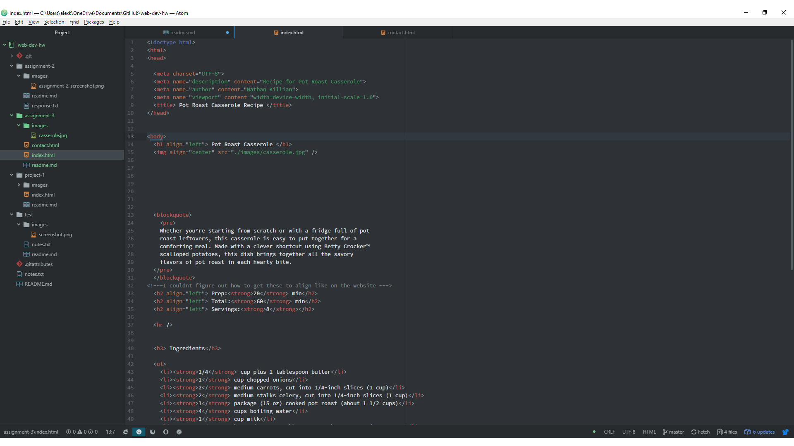

# Assignment 3 readme

1. A page can have one main head and body element. The head element contains metadata about your cite
that helps find your site in search engines while the body element holds all the visible content of
the site.
2. Structural markup creates the stucture in your document or cite while semantic markup is used to
 reinforce meaning within your cite. A couple examples of semantic would be creating italicized or bold words.
3. This assignment really opened my eyes to how intricate some websites are made. Even something as simple
as a site for recipes can be very in depth with the programing itself.

