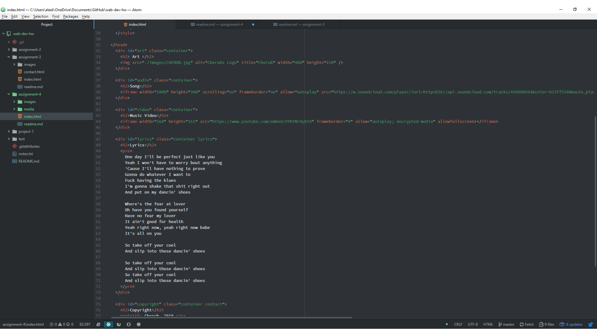

# Assignment 4 readme

1. A div is an element that allows us to group other elements together into a block, while a span is the same but functions on
a smaller scale within a div element. The id and class elements are used for styling instead of structuraly. An id is a global identifier
that allows is to uniquely identify elements. The class attribute allows us to group elements together for the purpose of styling. We can
assign backround colors or font types through classes and assign these classes to a group of elements within a div.
2. Alt text or escape codes are used anytime a character could be interpreted as markup by our browsers or when we there is a
symbol that we dont have a key for on our keyboards.
3. I was excited to learn about the division and grouping of elements within our bodies in html. I am rather OCD so the organization really
helped me. I was able to complete the assignment with no error and understood all the information presented to us.

