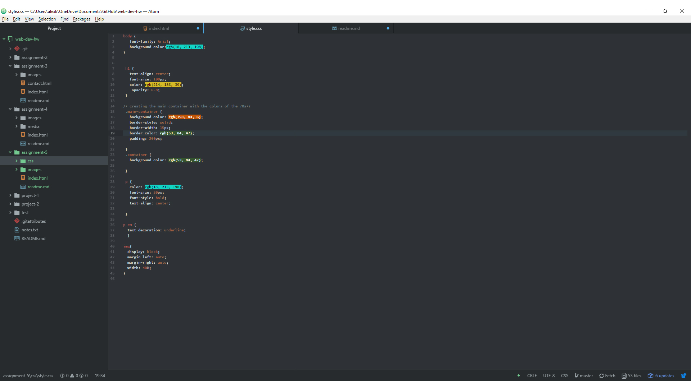

# Assignment 5 Report
1. For this assignment i chose the color pallet graphic from the 1970s section. To me it looked like the base of a computer monitor.
So i took that and placed a colored container on top of it to mimic the look of the monitor. I took all the tacky colors and mixed them
randomly within my page to just make it look as tacky and ugly as possible.
2. I think they term they use to describe the colors of the 70s is earth tones. This is because they all resemble natural colors seen in nature.
Some of the colors i used are rgb(214, 186, 39), rgb(18, 213, 198), rgb(193, 84, 6), and rgb(53, 84, 47).
3. The work cycle for me was rather easy. It was alot of applying what we already know to the seperate style sheet. I quite liked this because it cleaned up my
html file.

