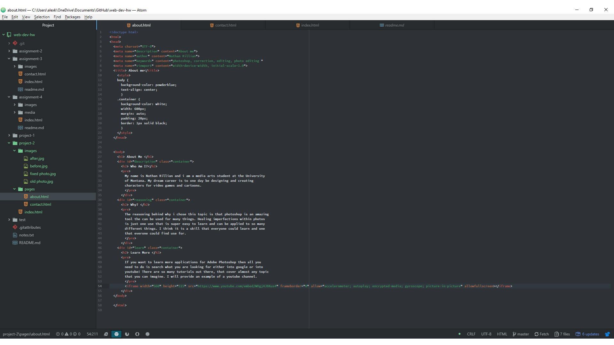

# Project 2 Report
## Nathan Killian

1. Learning the basics of HTML were rather easy compared to past experiences ive had with coding in javascript. Nothing was too difficult and i was
 able to breeze through it. The most interesting part for me was learning how to make a multiple page site and learning to style a site.
2. I see modern websites on a daily basis and i am excited to learn how to possibly emulate this type of style and form.
3. Instead of choosing to write out a lengthy discription of my tutorial i decided to make a short tutorial video and link it within my site using an iFrame.
This made the process of explaining how to fix immperfections in photos much shorter and easier for me. I didnt have any real problems completing this assignment
once i got started on it

